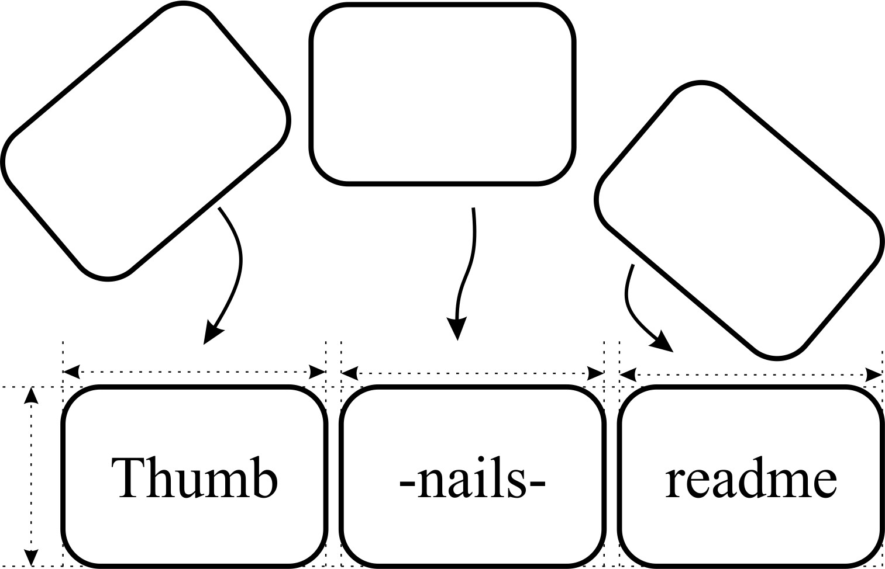

# thumbnails-readme --- Create thumbnails

## Create thumbnails for raster and vector images in parent and its subdirectories and append them to the README.md file

---


[](https://pepy.tech/project/thumbnails-readme)

[](https://github.com/firefly-cpp/thumbnails-readme/blob/master/LICENSE)

[](http://isitmaintained.com/project/firefly-cpp/thumbnails-readme "Average time to resolve an issue")
[](http://isitmaintained.com/project/firefly-cpp/thumbnails-readme "Percentage of issues still open")

<p align="center">
  
</p>


## Description
The "thumbnails-readme" package is a simple library devoted to automatically generating thumbnails from a directory. It is explicitly designed to create thumbnails from Git folders and show thumbnails in the README file of that Git folder.

### Multi-pages PDFs are turned into .gif thumbnails

Current supported filetype extensions are: ".bmp", ".gif", ".ico", "jpeg", ".jpg", ".png", ".tga", ".tiff", ".webp", ".pdf" and ".svg"

## GitHub action

See also the associated GitHub action in the following repository: [thumbnails-readme-action](https://github.com/KukovecRok/thumbnails-readme-action).

## How it works?

First step: program finds graphical material in your directories
* ['fig1.pdf', 'fig2.pdf', 'fig3.pdf', 'fig4.pdf']

Second step: program generates thumbnails for each material identified in folders


Third step: program appends thumbnails into README


## Installation
Install thumbnails-readme with pip:

```sh
pip install thumbnails-readme
```

In case you want to install directly from the source code, use:

```sh
$ git clone https://github.com/firefly-cpp/thumbnails-readme.git
$ cd thumbnails-readme
$ poetry build
$ python setup.py install
```

To install thumbnails-readme on Alpine Linux, please use:

```sh
$ apk add py3-thumbnails-readme
```

To install thumbnails-readme on Arch Linux, please use an [AUR helper](https://wiki.archlinux.org/title/AUR_helpers):

```sh
$ yay -Syyu python-thumbnails-readme
```

## Additional dependencies

### Windows
Windows users have to download poppler for Windows. Add poppler
path in your Python file (see the main example).

``` poppler_path = path/to/your/poppler/bin/ ```

for example: ```poppler_path = C:/Program Files/poppler-0.68.0/bin```

### Linux
Linux's users can install poppler-utils from the main repositories.

### Example

``` python
# Maximum thumbnail size - lower the number, smaller the thumbnail
MAX_SIZE = (128, 128)

# PDF quality, lower the number, lower the quality
pdf_quality = 15

# Skiplist - which directories to ignore
skiplist = (
    ".git",
    )


# Path to your directory
path = os.getcwd()
path = os.path.dirname(path)

# Path to the folder, you want new thumbnails to be placed in
path_to_thumbnails_folder = Path(path + "/image_thumbnails")

# Path to README.md file to be written to
path_to_readme = Path(path + "/README.md")
```

## Run the script

``` python
# Prepare thumbnails folder (check if exists, delete old thumbnails and create new ones)
thumbnails_readme.prepare_thumbnails_folder(path_to_thumbnails_folder)

# Prepare README.md file (check if exists, delete last modifications and place newly generated ones)
thumbnails_readme.prepare_readme(path_to_readme)

# Generate thumbnails
thumbnails_readme.crawl(path, path_to_readme, path_to_thumbnails_folder, MAX_SIZE, pdf_quality, skiplist, poppler_path)
```
## Use Cases

[https://github.com/firefly-cpp/figures](https://github.com/firefly-cpp/figures)

[https://github.com/firefly-cpp/posters](https://github.com/firefly-cpp/posters)

## License

This package is distributed under the BSD-3-Clause license. This license can be found online at <http://www.opensource.org/licenses/bsd-3-clause/>.

## Disclaimer

This framework is provided as-is, and there are no guarantees that it fits your purposes or that it is bug-free. Use it at your own risk!

# Thumbnails
[](tests/example-long.pdf)
[](tests/example-pdf.pdf)
[](tests/example-svg.svg)
[](tests/figures-main/association-rule-mining/arm-pipeline.pdf)
[](tests/figures-main/association-rule-mining/ARM_store.pdf)
[](tests/figures-main/association-rule-mining/ARM_store.png)
[](tests/figures-main/association-rule-mining/transaction-database.pdf)
[](tests/figures-main/association-rule-mining/transakcijska_baza.pdf)
[](tests/figures-main/automl/si/automl.pdf)
[](tests/figures-main/automl/si/cevovod.pdf)
[](tests/figures-main/automl/si/niaaml.pdf)
[](tests/figures-main/classification/metrike.pdf)
[](tests/figures-main/classification/MnozicaUcnaValidacijskaTestna.pdf)
[](tests/figures-main/classification/PodatkovnaUcnaValidacijskaTestnaMnozica.pdf)
[](tests/figures-main/classification/podrocja-strojnega-ucenja.pdf)
[](tests/figures-main/classification/podrocja-strojnega-ucenja.png)
[](tests/figures-main/classification/VariancaPristranskost.pdf)
[](tests/figures-main/clustering/primer-grucenje-sport.pdf)
[](tests/figures-main/data-cleaning/Ciscenje_podatkov.pdf)
[](tests/figures-main/data-cleaning/Ciscenje_podatkov.png)
[](tests/figures-main/data-mining/rudar.png)
[](tests/figures-main/data-mining/DM_steps/Atributte_Instance.pdf)
[](tests/figures-main/data-mining/DM_steps/Atributte_Instance.png)
[](tests/figures-main/data-mining/DM_steps/Atributte_Instance_missing_data.pdf)
[](tests/figures-main/data-mining/DM_steps/Atribut_Instanca.pdf)
[](tests/figures-main/data-mining/DM_steps/Atribut_Instanca.png)
[](tests/figures-main/data-mining/DM_steps/Atribut_Instanca_missing_data.pdf)
[](tests/figures-main/data-mining/DM_steps/Atribut_Instanca_missing_data.png)
[](tests/figures-main/data-mining/DM_steps/Atrribut_Instance_missing_data.png)
[](tests/figures-main/data-mining/DM_steps/DM_steps.pdf)
[](tests/figures-main/data-mining/DM_steps/DM_steps.png)
[](tests/figures-main/data-mining/DM_steps/DM_steps_slo.pdf)
[](tests/figures-main/data-mining/DM_steps/DM_steps_slo.png)
[](tests/figures-main/data-mining/preprocessing/one-hot-encoding.pdf)
[](tests/figures-main/data-mining/preprocessing/ordinal-encoding.pdf)
[](tests/figures-main/data-mining/preprocessing/Vrstice_stolpci.pdf)
[](tests/figures-main/data-mining/preprocessing/Vrstice_stolpci.png)
[](tests/figures-main/data-mining-in-sport/glyph_example.pdf)
[](tests/figures-main/data-mining-in-sport/heart-rate-monitor-to-data-mining-evolution.pdf)
[](tests/figures-main/data-mining-in-sport/pismenka-interval.pdf)
[](tests/figures-main/data-mining-in-sport/pismenka-trajanje.pdf)
[](tests/figures-main/digital-twin/artificial-sport-trainer/ast-diagram-1.pdf)
[](tests/figures-main/digital-twin/artificial-sport-trainer/ast-monitor.JPG)
[](tests/figures-main/digital-twin/artificial-sport-trainer/ast-outline-1.pdf)
[](tests/figures-main/digital-twin/model-EN/digital-twin-model.png)
[](tests/figures-main/digital-twin/model-EN/digital-twin-model.svg)
[](tests/figures-main/digital-twin/model-SI/digital-twin-model.png)
[](tests/figures-main/digital-twin/model-SI/digital-twin-model.svg)
[](tests/figures-main/feature-selection/feature-selection.pdf)
[](tests/figures-main/feature-selection/izbira-znacilnic.pdf)
[](tests/figures-main/hardware/jumper-wires.JPG)
[](tests/figures-main/hardware/smart_watch_and_ant+.jpg)
[](tests/figures-main/nature-inspired-algorithms/ants.pdf)
[](tests/figures-main/nature-inspired-algorithms/mapping.pdf)
[](tests/figures-main/nature-inspired-algorithms/natural_evolution_bears.pdf)
[](tests/figures-main/nature-inspired-algorithms/natural_evolution_bears.png)
[](tests/figures-main/nature-inspired-algorithms/natural_evolution_bears_small.png)
[](tests/figures-main/nature-inspired-algorithms/ring4.pdf)
[](tests/figures-main/neural-network/nevronska-mreza-primer.pdf)
[](tests/figures-main/nialogos/NiaLogos.png)
[](tests/figures-main/other/BSD.pdf)
[](tests/figures-main/other/BSD.svg)
[](tests/figures-main/other/BSD_attribution.pdf)
[](tests/figures-main/other/BSD_no_attribution.pdf)
[](tests/figures-main/other/hvala.pdf)
[](tests/figures-main/other/LinuxDistro.pdf)
[](tests/figures-main/other/LinuxDistro_attribution.pdf)
[](tests/figures-main/other/niapy_logo.png)
[](tests/figures-main/other/OS.pdf)
[](tests/figures-main/other/OS_no_attribution.pdf)
[](tests/figures-main/other/PortaliInSistemiZnanja_logotipi.pdf)
[](tests/figures-main/other/PortaliInSistemiZnanja_logotipi_no_attribution.pdf)
[](tests/figures-main/other/vprasaj.pdf)
[](tests/figures-main/programming/haskell/yesod-framework/gradniki.PNG)
[](tests/figures-main/programming/haskell/yesod-framework/hello_world.PNG)
[](tests/figures-main/programming/haskell/yesod-framework/hello_yesod.PNG)
[](tests/figures-main/programming/haskell/yesod-framework/popularnost-haskell.PNG)
[](tests/figures-main/software-packages/sport-activities-features.pdf)
